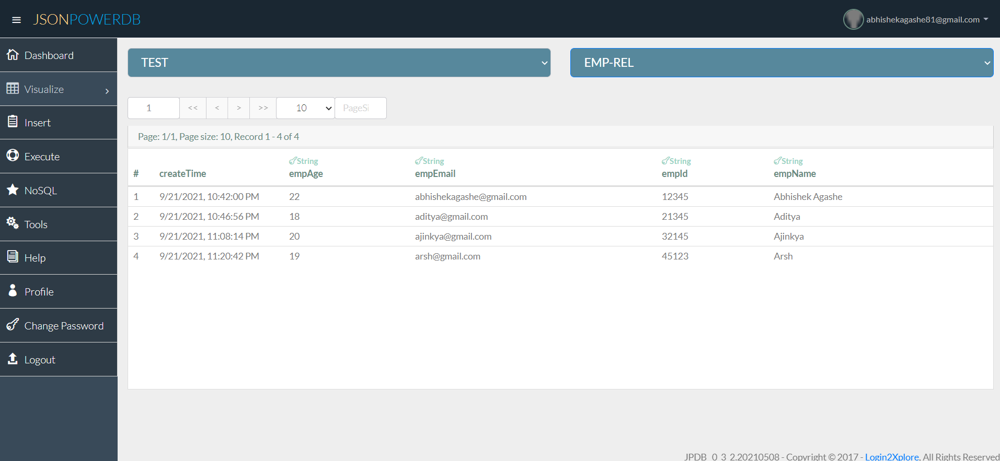

# JPDB_Project

This Project is useful for learning basics of JsonPowerDB (JPDB) and it's implementation. Inserting the data in JPDB and Showing the result was implemented in this Project. We can use JPDB for storing different type of data with ease as well as we can use Talend API tester for working with the data.  

[Link to Documentation](http://login2explore.com/jpdb/docs.html)

## About JsonPowerDB:

- JsonPowerDB is a Real-time, High Performance, Lightweight and Simple to Use, Rest API based Multi-mode DBMS. JsonPowerDB has ready to use API for Json document DB, RDBMS, Key-value DB, GeoSpatial DB and Time Series DB functionality. JPDB supports and advocates for true serverless and pluggable API development.

## Benefits of using JsonPowerDB

- Simplest way to retrieve data in a JSON format.
- Schema-free, Simple to use, Nimble and In-Memory database.
- It is built on top of one of the fastest and real-time data indexing engine - PowerIndeX.
- It is low level (raw) form of data and is also human readable.
- It helps developers in faster coding, in-turn reduces development cost.

## Output Images :

